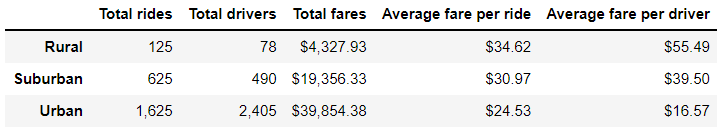

# PyBer_Analysis
## The purpose
Using your Python skills and knowledge of Pandas, I will create a summary DataFrame of the ride-sharing data by city type. Then, using Pandas and Matplotlib, I’ll create a multiple-line graph that shows the total weekly fares for each city type. Finally, I will report that summarizes how the data differs by city type and how those differences can be used by decision-makers at PyBer.
## Results
### Summary Dataframe
two data sets were merging using the groupby() function:

We can tell that the urban city has more drivers than total rides. Also, the rural and suburban city has less drivers than rides.

### Total fare 

In this chart, we can tell that that urban and suburban start off good  and rural had a decline in January. Then, all 3 start to rise at the end of February.Finally. urban and rural stay still and suburban has a rise in april.
## Summary 
1) We can conlude that urban cities make more money than rural cities. Also, we can see the rural cities are more spread out which has a higher fare per ride. Also, we need more data than just 4 months. I would recomend to have a year of data is this Fares.

2) Pyber needs to invest in advertising to increase the total rides because a shortage of drivers can occur in urban cities.

3) Also, another solution I can recommend to Pyber is to try to get more drivers out to rural and suburban areas since they are so many drivers in urban cities.
