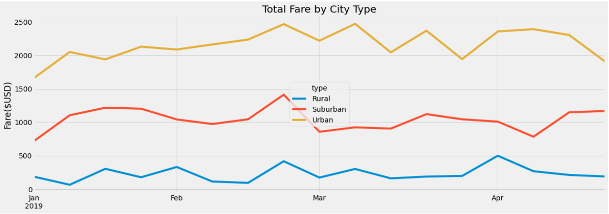

# PyBer_Analysis
## The purpose
Isualize has given you and Omar a brand-new assignment. Using your Python skills and knowledge of Pandas, you’ll create a summary DataFrame of the ride-sharing data by city type. Then, using Pandas and Matplotlib, you’ll create a multiple-line graph that shows the total weekly fares for each city type. Finally, you’ll submit a written report that summarizes how the data differs by city type and how those differences can be used by decision-makers at PyBer.
## Results

## Summary 
1) We can conlude that urban cities make more money than rural cities. Also, we can see the rural cities are more spread out which has a higher fare per ride.
2) Pyber needs to invest in advertising to increase the total rides because a shortage of drivers can occur.
3)Also, another solution I can recommend to Pyber is to try to get more drivers out to rural and suburban areas since they are so many drivers in urban cities.
